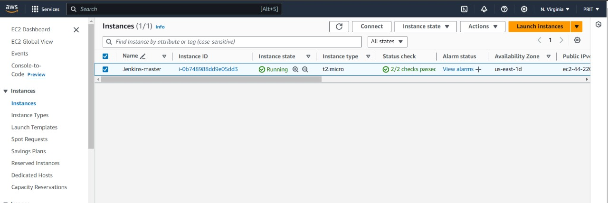
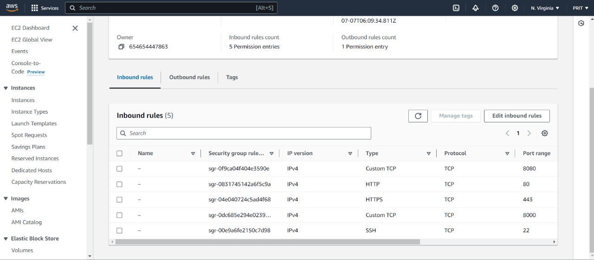
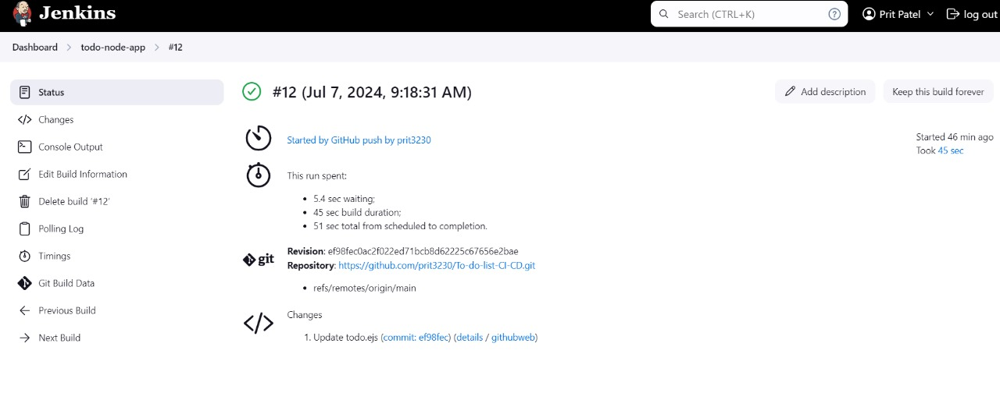
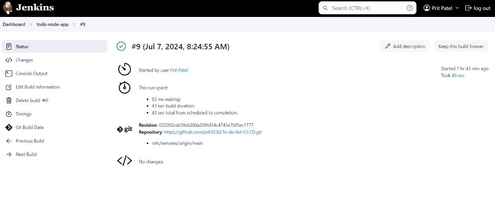

# Jenkins CI/CD Pipeline for To-Do Application

This project demonstrates the deployment of a Dockerized Todo application with an automated CI/CD pipeline using Jenkins, hosted on AWS EC2.

## Project Overview

- **Developed a scalable Dockerized Todo application.**
- **Implemented Jenkins CI/CD pipeline** for automated build, test, and deployment processes.
- **Utilized AWS EC2** for hosting Jenkins and Docker.

## Prerequisites

Before you begin, ensure you have met the following requirements:
- You have an AWS account and are familiar with creating and managing EC2 instances.
- You have SSH access to your EC2 instance.
- You have basic knowledge of Docker and Jenkins.
- Your local machine has Git installed and configured.

## Steps to Reproduce

### 1. Create AWS EC2 Instance
1. Launch an EC2 instance using your preferred settings.
2. Connect to your instance using SSH.

*Example Screenshots of EC2 Instance Setup:*




### 2. Install Jenkins
1. Update packages:
    ```sh
    sudo apt update
    ```
2. Install OpenJDK 11:
    ```sh
    sudo apt install openjdk-11-jre
    java -version
    ```
3. Add Jenkins key and repository:
    ```sh
    curl -fsSL https://pkg.jenkins.io/debian/jenkins.io.key | sudo tee /usr/share/keyrings/jenkins-keyring.asc > /dev/null
    echo deb [signed-by=/usr/share/keyrings/jenkins-keyring.asc] https://pkg.jenkins.io/debian binary/ | sudo tee /etc/apt/sources.list.d/jenkins.list > /dev/null
    ```
4. Install Jenkins:
    ```sh
    sudo apt-get update
    sudo apt-get install jenkins
    sudo systemctl enable jenkins
    sudo systemctl start jenkins
    sudo systemctl status jenkins
    ```
5. Retrieve Jenkins initial admin password:
    ```sh
    sudo cat /var/lib/jenkins/secrets/initialAdminPassword
    ```


### 3. Install Docker
1. Install Docker:
    ```sh
    sudo apt install docker.io
    ```
2. Add your user to the Docker group:
    ```sh
    sudo usermod -aG docker $USER
    ```

### 4. Setup Jenkins Job
1. Go to your Jenkins instance URL and log in.
2. Create a new freestyle project.
3. Configure the project to pull your repository from GitHub.
4. In the build section, add the following shell commands to build and run the Docker container:
    ```sh
    docker build -t node-app-todo .
    docker run -d --name node-app-container -p 8000:8000 node-app-todo
    ```

*Example Screenshot of Jenkins Job Configuration:*

 


### 5. Dockerfile
Create a `Dockerfile` in your project root with the following content:
```dockerfile
FROM node:12.2.0-alpine
WORKDIR /app
COPY . .
RUN npm install
EXPOSE 8000
CMD ["node", "app.js"]
